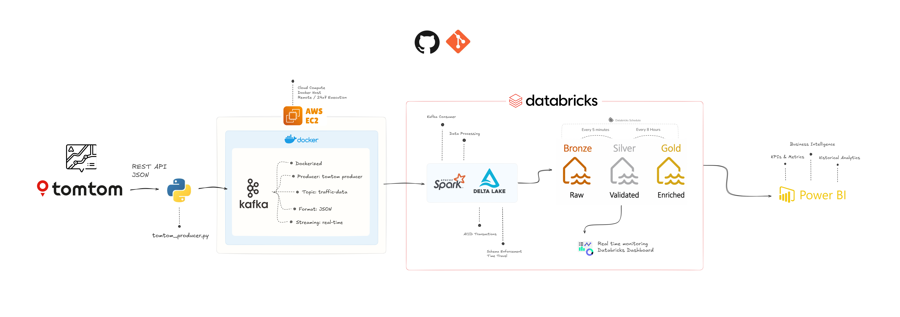
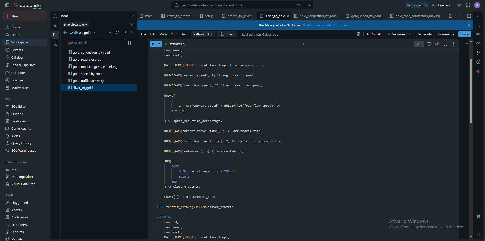
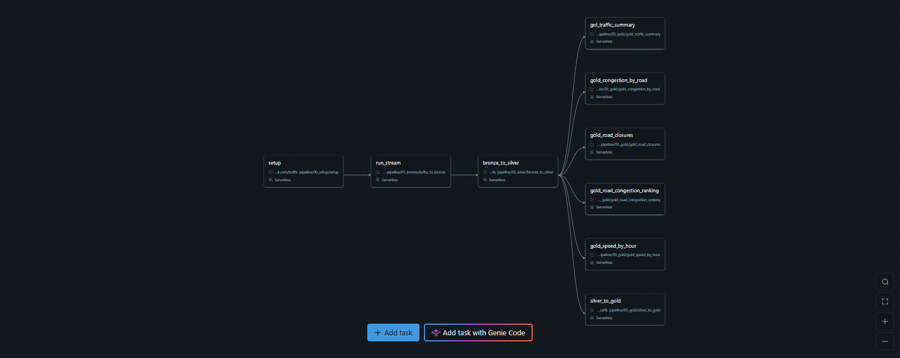
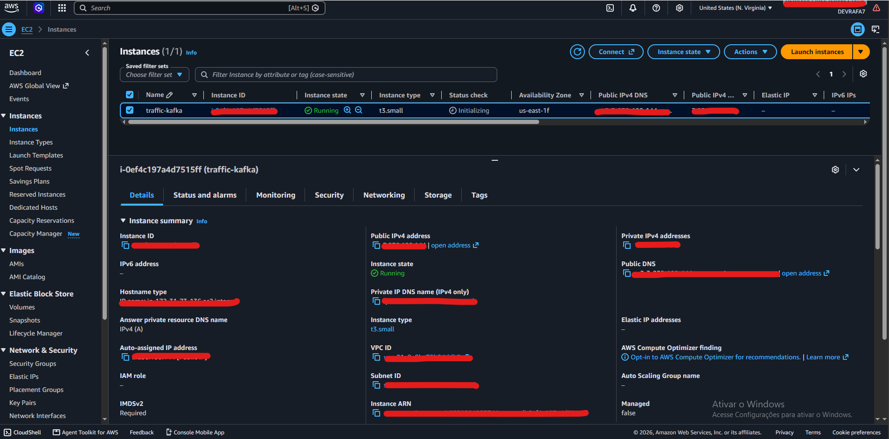
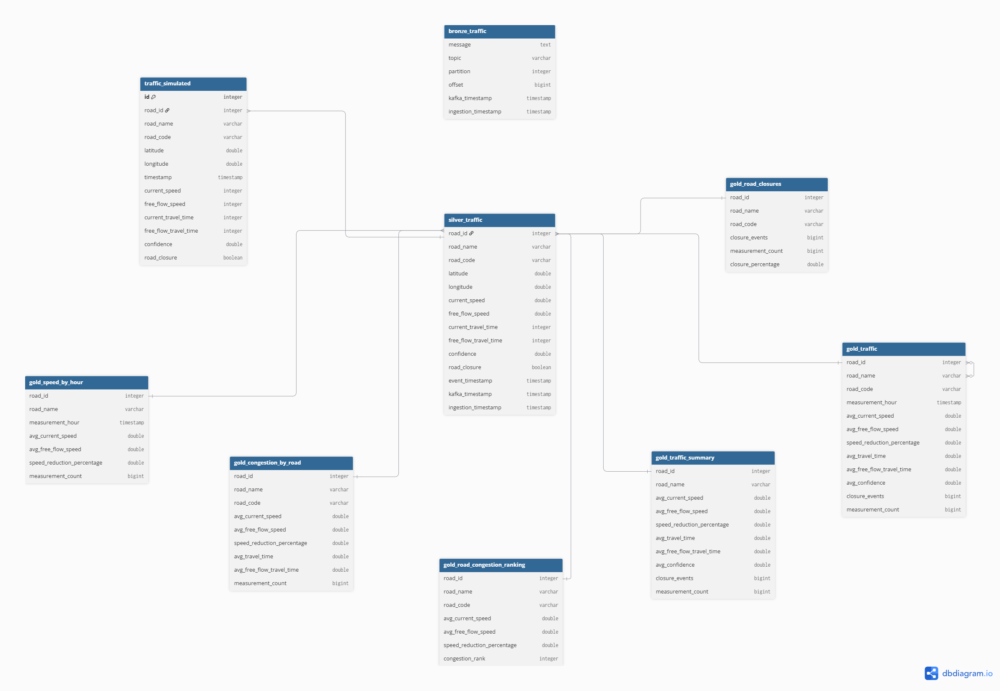
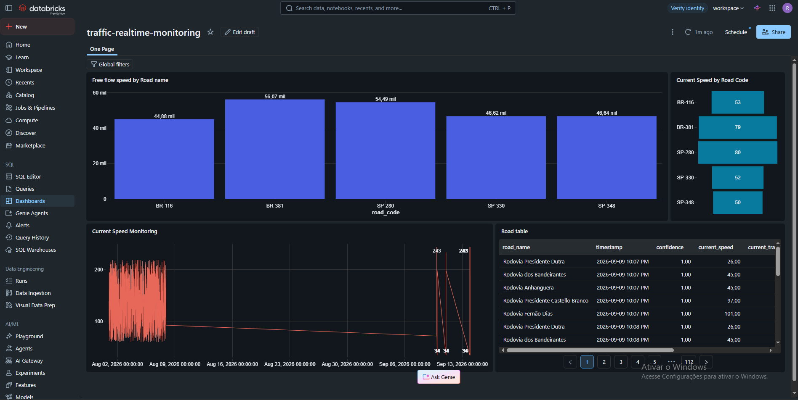
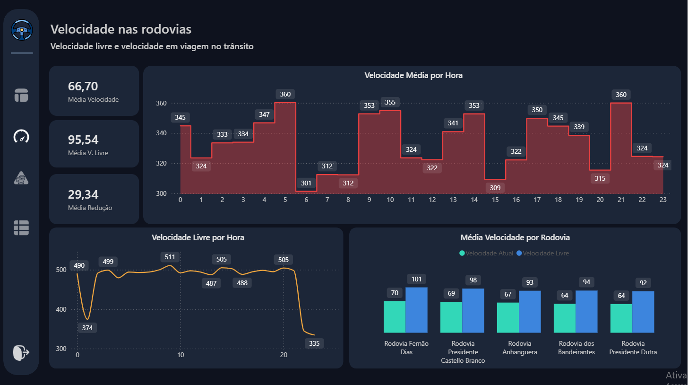

# 🚦 Real-Time Traffic Data Pipeline

End-to-end Data Engineering pipeline for collecting, streaming, processing and analyzing real-time traffic data.

The project consumes traffic information from the **TomTom Traffic API**, publishes events to **Apache Kafka**, processes the streaming data using **Apache Spark Structured Streaming** and stores the data in a **Databricks Lakehouse** using **Delta Lake** and the **Medallion Architecture**.

The processed data is then consumed through **Databricks Dashboards** for near real-time monitoring and **Power BI** for historical analytics and business intelligence.

---

## 📌 Project Overview

This project simulates a real-world real-time Data Engineering architecture.

Every 30 seconds, the Python Producer queries the TomTom Traffic API for selected highways and roads and publishes the collected traffic events to a Kafka topic.

Apache Spark consumes the Kafka stream, parses the JSON messages and processes the incoming traffic events.

The data is then stored and transformed in Databricks following the Medallion Architecture:

```text
Bronze → Silver → Gold
```

Where:

- **Bronze** stores raw ingested data
- **Silver** stores cleaned and validated data
- **Gold** stores analytics-ready data and aggregations

The resulting Lakehouse is consumed by:

- Databricks Dashboard → near real-time traffic monitoring
- Power BI → historical analytics and KPIs

---

# 🏗️ Architecture



# 🎯 Project Objectives

The main objectives of the project are:

- Build an end-to-end real-time data pipeline
- Consume data from a public REST API
- Implement event streaming using Apache Kafka
- Process streaming data with Apache Spark
- Implement a Lakehouse architecture
- Use Delta Lake for reliable data storage
- Implement the Medallion Architecture
- Separate raw, validated and analytical data
- Create near real-time traffic monitoring
- Create historical traffic analytics
- Integrate Databricks with Power BI
- Run the infrastructure using Docker
- Deploy the streaming infrastructure on AWS EC2
- Apply Data Engineering concepts commonly used in production environments

---

# 🛠️ Technologies

## Data Source

### TomTom Traffic API

Provides real-time traffic information for selected road segments.

The project collects information such as:

- Current speed
- Free-flow speed
- Current travel time
- Free-flow travel time
- Traffic confidence
- Road closure
- Geographic coordinates

---

## Programming

### Python

Used to:

- Consume the TomTom API
- Transform API responses
- Build Kafka events
- Publish messages to Kafka

Main libraries:

```text
requests
python-dotenv
confluent-kafka
```

---

## Streaming

### Apache Kafka

Kafka is used as the event streaming platform between the API ingestion layer and Spark.

Topic:

```text
traffic-data
```

Messages are serialized as JSON.

Example:

```json
{
  "road_id": 2,
  "road_name": "Rodovia dos Bandeirantes",
  "road_code": "SP-348",
  "latitude": -23.4542,
  "longitude": -46.8495,
  "current_speed": 45,
  "free_flow_speed": 45,
  "current_travel_time": 763,
  "free_flow_travel_time": 763,
  "confidence": 1,
  "road_closure": false,
  "timestamp": 1789338861.4731371
}
```

---

## Processing

### Apache Spark

Apache Spark Structured Streaming consumes the Kafka topic and processes incoming traffic events.

Responsibilities:

- Consume Kafka messages
- Convert Kafka binary values to strings
- Parse JSON
- Apply an explicit schema
- Convert JSON fields into Spark columns
- Process streaming events

---

## Lakehouse

### Databricks

Databricks is used as the main data platform for:

- Data processing
- Delta Lake storage
- Medallion Architecture
- Data transformation
- Data quality
- Scheduling
- Dashboards
- Analytics

---

## Delta Lake

Delta Lake is the storage layer used to build the Lakehouse.

The project uses Delta tables instead of treating the data only as raw files.

Delta Lake provides capabilities such as:

- ACID transactions
- Schema enforcement
- Schema evolution
- Time travel
- Reliable reads and writes
- Transactional data pipelines

This allows the project to combine the flexibility of a data lake with capabilities commonly associated with data warehouses.

---

# 🧱 Medallion Architecture

The Databricks Lakehouse follows the Medallion Architecture.

```text
              ┌───────────────┐
              │    BRONZE     │
              │               │
              │ Raw Data      │
              └───────┬───────┘
                      │
                      ▼
              ┌───────────────┐
              │    SILVER     │
              │               │
              │ Cleaned       │
              │ Validated     │
              │ Structured    │
              └───────┬───────┘
                      │
                      ▼
              ┌───────────────┐
              │     GOLD      │
              │               │
              │ Aggregations  │
              │ KPIs          │
              │ Analytics     │
              └───────────────┘
```

---

# 🏞️ Lakehouse

The project implements a Lakehouse architecture using:

```text
Databricks
    +
Delta Lake
    +
Medallion Architecture
```

Conceptually:

The Lakehouse allows the same platform to support both streaming ingestion and analytical workloads.

---

## 🧱 Databricks



---

# 🥉 Bronze Layer

The Bronze layer is responsible for storing the ingested data with minimal transformation.

The purpose is to preserve the original information received by the pipeline.

Example table:

```text
traffic_catalog.bronze.bronze_traffic
```

The Bronze layer can contain:

- Kafka message
- Kafka topic
- Kafka partition
- Kafka offset
- Kafka timestamp
- Ingestion timestamp

This layer provides traceability between Kafka and the Lakehouse.

---

# 🥈 Silver Layer

The Silver layer contains cleaned and structured traffic data.

At this stage, the pipeline:

- Parses JSON
- Applies the expected schema
- Converts data types
- Validates fields
- Removes invalid records
- Handles data quality problems
- Structures the traffic events into analytical columns

Example table:

```text
traffic_catalog.silver.silver_traffic
```

Main columns:

| Column | Type | Description |
|---|---|---|
| `road_id` | INT | Unique road identifier |
| `road_name` | STRING | Road name |
| `road_code` | STRING | Highway/road code |
| `latitude` | DOUBLE | Geographic latitude |
| `longitude` | DOUBLE | Geographic longitude |
| `current_speed` | DOUBLE | Current traffic speed |
| `free_flow_speed` | DOUBLE | Expected free-flow speed |
| `current_travel_time` | INT | Current travel time |
| `free_flow_travel_time` | INT | Expected free-flow travel time |
| `confidence` | DOUBLE | TomTom confidence value |
| `road_closure` | BOOLEAN | Indicates road closure |
| `event_timestamp` | TIMESTAMP | Traffic event timestamp |
| `kafka_timestamp` | TIMESTAMP | Kafka ingestion timestamp |
| `ingestion_timestamp` | TIMESTAMP | Pipeline ingestion timestamp |

---

# 🥇 Gold Layer

The Gold layer contains analytics-ready data.

The objective is to avoid forcing BI tools to perform complex transformations on raw or operational data.

Examples of metrics generated in the Gold layer include:

- Average current speed
- Average free-flow speed
- Speed reduction percentage
- Average travel time
- Average free-flow travel time
- Average confidence
- Number of closure events
- Number of traffic measurements
- Traffic performance by road
- Traffic performance over time

Example analytical table:

```text
traffic_catalog.gold.traffic_metrics
```

A typical Gold dataset can contain:

```text
road_id
road_name
road_code
measurement_hour
avg_current_speed
avg_free_flow_speed
speed_reduction_percentage
avg_travel_time
avg_free_flow_travel_time
avg_confidence
closure_events
measurement_count
```

---

# ⏱️ Pipeline Scheduling

The project uses different processing frequencies depending on the use case.

## Real-Time Pipeline

Bronze and Silver processing:

```text
Every 5 minutes
```

This supports near real-time traffic monitoring through the Databricks Dashboard.

---

## Historical Analytics

Gold processing:

```text
Every 8 hours
```

The Gold layer provides aggregated historical data for Power BI.

This separation allows the project to maintain a more frequent operational pipeline while reducing unnecessary processing for historical analytical workloads.

---


---

# 💼 Jobs / Workflows

This project uses scheduled processing jobs/workflows to separate near real-time operational processing from historical analytical processing.



# 📂 Project Structure

```text
realtime-traffic-pipeline/
│
├── producer/
│   └── tomtom_producer.py
│
├── spark/
│   ├── Dockerfile
│   └── traffic_consumer.py
│
├── kafka/
│   └── docker-compose.yml
│
├── docs/
│   ├── pipeline-architecture.png
│   ├── jobs.png
│   ├── databricks.png
│   ├── ec2.png
│   ├── data-modeling.png
│   ├── dashboard-realtime.png
│   └── dashboard-analytics-pbi.png
│
├── .env
├── .gitignore
└── README.md
```

---

# ⚙️ Requirements

Before running the project locally, install:

- Python 3.10+
- Docker
- Docker Compose
- Git

For cloud execution:

- AWS account
- EC2 instance
- Docker installed on EC2
- TomTom API key

---

# 🔑 Environment Variables

Create a `.env` file inside the project root:

```env
TOMTOM_API_KEY=your_tomtom_api_key
KAFKA_SERVER=your_kafka_server:9092
```

The API key must **not** be committed to GitHub.

Make sure `.env` is included in `.gitignore`:

```gitignore
.env
__pycache__/
.venv/
```

---

# 🚀 Running the Project

## 1. Clone the repository

```bash
git clone https://github.com/devrafael7/realtime-traffic-pipeline.git
```

```bash
cd realtime-traffic-pipeline
```

---

# 2. Create Python Environment

Windows:

```powershell
python -m venv .venv
```

Activate:

```powershell
.\.venv\Scripts\Activate.ps1
```

Install dependencies:

```powershell
pip install requests python-dotenv confluent-kafka
```

---

# 3. Start Kafka and Spark

Navigate to the Kafka directory:

```bash
cd kafka
```

Start the containers:

```bash
docker compose up -d
```

Check running containers:

```bash
docker ps
```

Expected services:

```text
traffic-kafka
traffic-spark
```

---

# 4. Verify Kafka

Check the Kafka container:

```bash
docker logs traffic-kafka
```

The Kafka broker should be running and exposing:

```text
9092
```

> ⚠️ **IMPORTANT — Port 9092 is open for the pilot/demo environment only.**
>
> The current setup exposes Kafka on port `9092` to make the pilot easier to run and validate. **Do not deploy this configuration to production as-is.**
>
> For production, restrict Kafka network access using AWS Security Groups/firewall rules, private networking where applicable, authentication and encryption (for example TLS/SASL), and only allow trusted clients to reach the broker.

Inside the Docker network, Kafka is available through:

```text
kafka:29092
```

The Kafka topic used by the project is:

```text
traffic-data
```

---

# 5. Run the Python Producer

From the project root:

```bash
python producer/tomtom_producer.py
```

The producer will:

1. Request traffic data from TomTom
2. Process the API response
3. Create a JSON event
4. Publish the event to Kafka
5. Wait 30 seconds
6. Repeat the process

Example:

```text
TrafficPulse Kafka Producer iniciado...

Consultando TomTom → Rodovia Presidente Dutra
Enviado para Kafka → traffic-data | road_id=1

Consultando TomTom → Rodovia dos Bandeirantes
Enviado para Kafka → traffic-data | road_id=2
```

---

# 6. Run Spark Consumer

The Spark container connects to Kafka using:

```text
kafka:29092
```

The Spark application subscribes to:

```text
traffic-data
```

Spark then:

```text
Kafka
  ↓
Binary value
  ↓
String
  ↓
JSON
  ↓
Structured Schema
  ↓
Spark DataFrame
```

The current consumer can display incoming events in the console.

---

# 🐳 Docker

The Spark container is based on:

```dockerfile
FROM apache/spark:4.0.1
```

The application is submitted using:

```bash
spark-submit
```

with the Kafka connector:

```text
org.apache.spark:spark-sql-kafka-0-10_2.13:4.0.1
```

The Dockerized Spark application uses:

```text
Spark 4.0.1
```

and Kafka:

```text
Apache Kafka 4.3.1
```

Docker Compose manages the streaming services and their networking.

---

# ☁️ AWS EC2

For cloud execution, the infrastructure can run on an AWS EC2 instance.

The architecture is:

```text
AWS EC2
│
└── Docker
    │
    ├── Apache Kafka
    │
    └── Apache Spark
```

The EC2 instance provides the cloud compute environment required to keep the streaming infrastructure running independently from the local development machine.

---



---

# 🔄 Data Flow

The complete data flow is:

```text
TomTom API
     │
     │ REST API
     ▼
Python Producer
     │
     │ JSON
     ▼
Apache Kafka
     │
     │ traffic-data
     ▼
Spark Structured Streaming
     │
     │ JSON parsing
     │ Schema validation
     ▼
Databricks / Delta Lake
     │
     ▼
Bronze
     │
     │ Cleaning / Validation
     ▼
Silver
     │
     ├──────────────► Databricks Dashboard
     │
     │ Aggregation
     ▼
Gold
     │
     ▼
Power BI
```

---

# 📊 Traffic Data

The project monitors five roads:

| ID | Road | Code |
|---|---|---|
| 1 | Rodovia Presidente Dutra | BR-116 |
| 2 | Rodovia dos Bandeirantes | SP-348 |
| 3 | Rodovia Anhanguera | SP-330 |
| 4 | Rodovia Presidente Castello Branco | SP-280 |
| 5 | Rodovia Fernão Dias | BR-381 |

---

# 📈 Analytics

The pipeline enables analysis of:

## Traffic Speed

Comparison between:

```text
Current Speed
vs
Free Flow Speed
```

---

## Speed Reduction

A traffic congestion indicator:

```text
Speed Reduction %
=
1 - (Current Speed / Free Flow Speed)
```

Higher values indicate a larger reduction relative to normal free-flow conditions.

---

## Travel Time

Comparison between:

```text
Current Travel Time
vs
Free Flow Travel Time
```

---

## Road Closures

The `road_closure` field allows identification of road closure events.

---

## Traffic Confidence

The TomTom confidence value is preserved in the pipeline and can be used as a data-quality/context indicator.

---

# 🔍 Data Quality

The Silver layer is responsible for preparing data for analytical consumption.

Examples of validations that can be applied include:

- Null values
- Invalid road IDs
- Invalid speeds
- Invalid travel times
- Invalid confidence values
- Duplicate events
- Invalid geographic coordinates
- Schema inconsistencies

The objective is to prevent low-quality records from propagating into the Gold layer and BI dashboards.

---

# 🗂️ Data Modeling

The project uses structured Bronze, Silver and Gold layers to organize the traffic data from ingestion through analytical consumption.



---

# 📊 Dashboards

## Databricks Dashboard



Used for near real-time operational monitoring.

Examples:

- Current traffic speed by road
- Traffic condition
- Speed reduction
- Road closures
- Traffic confidence
- Traffic measurements over time

The dashboard consumes processed Silver data.

---

## Power BI



Power BI is used for historical and analytical reporting.

Examples:

- Historical traffic trends
- Average speed by road
- Speed reduction
- Travel time
- Road performance
- Traffic KPIs
- Closure events

The Power BI semantic model consumes analytics-ready Gold data.

---

# 🔐 Security Considerations

The project uses environment variables for API credentials.

Never commit:

```text
.env
API keys
AWS credentials
Passwords
Private keys
```

The Kafka infrastructure should also be protected using appropriate AWS Security Group rules.

### ⚠️ Kafka Port 9092 — Pilot Only

The repository's current Kafka configuration may expose port `9092` for the **pilot/demo environment**.

**This is not a production-ready network configuration and should not be promoted to production without hardening.** Do not leave Kafka exposed to the public internet or `0.0.0.0/0` in a production environment.

For production, network access should be restricted to trusted sources and the Kafka deployment should use appropriate authentication, encryption, firewall/Security Group rules, and private networking where applicable.

---

# 🧠 Engineering Concepts Demonstrated

This project demonstrates several Data Engineering concepts:

- REST API ingestion
- Event-driven architecture
- Streaming data
- Apache Kafka
- Kafka topics
- Kafka producers
- Kafka consumers
- Apache Spark
- Structured Streaming
- JSON parsing
- Schema enforcement
- Data transformation
- Data quality
- Delta Lake
- Lakehouse architecture
- Medallion Architecture
- Bronze / Silver / Gold
- Batch and streaming workloads
- Cloud infrastructure
- AWS EC2
- Docker
- Docker Compose
- Data visualization
- Power BI
- Databricks Dashboards
- Git
- GitHub

---

# 🗺️ Future Improvements

Possible improvements for future versions:

- Implement automated data-quality checks
- Add dead-letter/error tables for invalid events
- Add pipeline monitoring and alerting
- Implement Kafka persistence and retention strategies
- Add more road segments
- Add historical weather data
- Integrate machine learning for traffic prediction
- Predict traffic congestion for the next 15–30 minutes
- Implement anomaly detection
- Add CI/CD
- Improve observability
- Add automated testing
- Add infrastructure as code

---

# 👨‍💻 Author

**Rafael Oliveira**

Software Engineering student focused on:

- Data Engineering
- Data Analytics
- Data Science
- Cloud Data Platforms

---

# 📚 Main Technologies

```text
Python
Apache Kafka
Apache Spark
Spark Structured Streaming
Delta Lake
Databricks
AWS EC2
Docker
Docker Compose
Power BI
Git
GitHub
TomTom Traffic API
```

---

# ⭐ Project Architecture Summary

```text
                 REAL-TIME DATA PIPELINE

TomTom API
     │
     ▼
Python Producer
     │
     ▼
Apache Kafka
     │
     ▼
Spark Structured Streaming
     │
     ▼
Databricks Lakehouse
     │
     ├── Bronze ──► Raw Data
     │
     ├── Silver ──► Cleaned & Validated
     │                  │
     │                  └──► Databricks Dashboard
     │
     └── Gold ────► Analytics Ready
                         │
                         └──► Power BI
```

---

## 🏁 Final Result

The final architecture combines real-time ingestion, event streaming, distributed processing and analytical workloads into a single end-to-end Data Engineering pipeline.

The project demonstrates how traffic data can be collected from an external API, streamed through Kafka, processed using Spark and organized in a Databricks Lakehouse using Delta Lake and the Medallion Architecture.

The resulting data can then support both **near real-time operational monitoring** and **historical business analytics**.

---

# ⚠️ Technical Notes

The current local Spark consumer is responsible for consuming and parsing Kafka events and displaying them in the console. The Databricks environment is responsible for the Lakehouse implementation and the Bronze/Silver/Gold Delta tables.

The Producer should keep credentials and environment-specific configuration outside the source code through environment variables.

Before publishing the repository, verify that no API keys, AWS credentials or other secrets are present in Git history.
